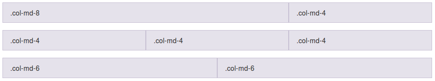
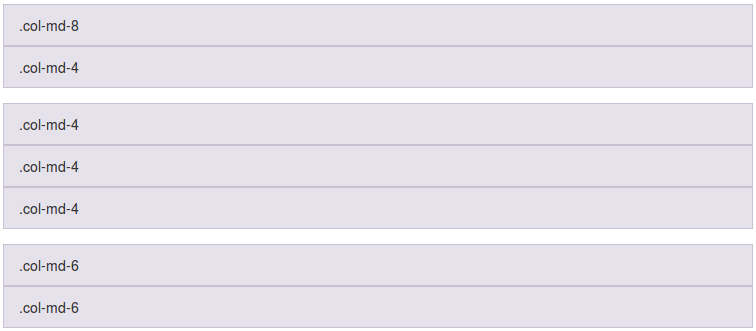
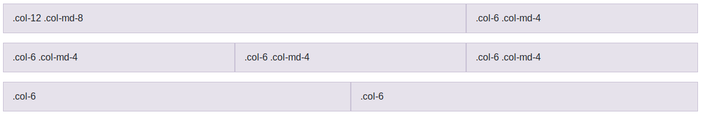
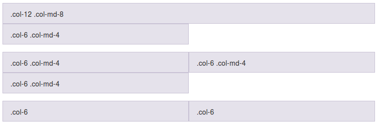
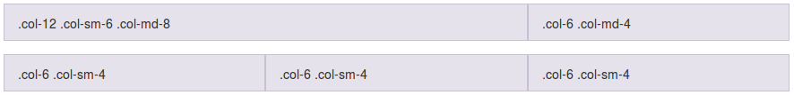
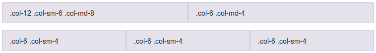
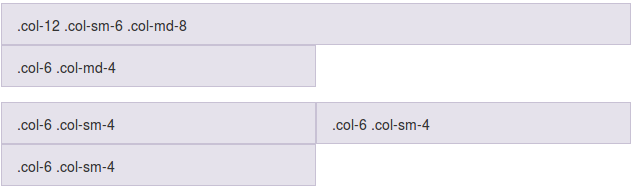

# 3.1. Columnas de ancho específico

A continuación se incluyen algunos ejemplos de uso del sistema de rejilla que nos ayudarán a comprender mejor su funcionamiento.

### Selección de tamaño de las columnas solo para pantallas medianas

En el siguiente ejemplo se han creado 3 filas, la primera dividida en 2 columnas de tamaño desigual, la segunda en 3 columnas de igual tamaño y la tercera en 2 columnas también de igual tamaño.

```html
<div class="row">
  <div class="col-md-8">.col-md-8</div>
  <div class="col-md-4">.col-md-4</div>
</div>
<div class="row">
  <div class="col-md-4">.col-md-4</div>
  <div class="col-md-4">.col-md-4</div>
  <div class="col-md-4">.col-md-4</div>
</div>
<div class="row">
  <div class="col-md-6">.col-md-6</div>
  <div class="col-md-6">.col-md-6</div>
</div>
```

En la siguiente imagen se puede ver el resultado para pantallas de tamaño mediano (tamaños de md en adelante):



> Para poder visualizar las columnas se ha añadido una clase CSS que establece color para el borde y el fondo de las cajas. Por defecto, ni la etiqueta DIV ni las etiquetas .col-\* establecen apariencia (ni color de borde ni de fondo), solamente establecen la anchura, y por lo tanto al renderizar el código anterior tal cual las cajas se verán transparentes.

Dado que las columnas se han especificado únicamente mediante las clases `.col-md-*` esto creará estas divisiones solo para las pantallas medianas y grandes, pero no para los tamaños de pantalla más pequeños. En este último caso las columnas se ampliarán para ocupar todo el ancho y por lo tanto se mostrarán apiladas de la forma:



### Selección de dos tamaños de columna: pequeño y mediano

Si no queremos que las columnas se muestren apiladas para tamaños de pantalla pequeños podemos indicar también la disposición para esos casos mediante las clases `.col-*` además de las que ya teníamos con `.col-md-*`. Por ejemplo:

```html
<!-- En pantallas pequeñas aparecerá una columna que ocupará todo el ancho
y otra que ocupará la mitad de la pantalla -->
<div class="row">
  <div class="col-12 col-md-8">.col-12 .col-md-8</div>
  <div class="col-6 col-md-4">.col-6 .col-md-4</div>
</div>

<!-- En pantallas medianas se indica que cada columna ocupe la mitad
del ancho disponible -->
<div class="row">
  <div class="col-6 col-md-4">.col-6 .col-md-4</div>
  <div class="col-6 col-md-4">.col-6 .col-md-4</div>
  <div class="col-6 col-md-4">.col-6 .col-md-4</div>
</div>

<!-- Como no se indica el tamaño para pantallas grandes las columnas
siempre ocuparán el 50% -->
<div class="row">
  <div class="col-6">.col-6</div>
  <div class="col-6">.col-6</div>
</div>
```

En la siguiente imagen se puede ver como quedaría el código de ejemplo para pantallas medianas y grandes (tamaños de md en adelante):


En el caso de pantallas pequeñas las columnas se verían de la forma:



### Selección de tres tamaños: extra pequeño, pequeño y mediano

Si queremos tener un mayor control podemos especificar también el tamaño de las columnas para las pantallas tipo _small_ con las clases `.col-sm-*`. Por ejemplo:

```html
<div class="row">
  <div class="col-12 col-sm-6 col-md-8">.col-12 .col-sm-6 .col-md-8</div>
  <div class="col-6 col-md-4">.col-6 .col-md-4</div>
</div>
<div class="row">
  <div class="col-6 col-sm-4">.col-6 .col-sm-4</div>
  <div class="col-6 col-sm-4">.col-6 .col-sm-4</div>
  <div class="col-6 col-sm-4">.col-6 .col-sm-4</div>
</div>
```

A continuación se incluye una previsualización de este código de ejemplo para pantallas medianas y grandes (tamaños md, lg, xl y xxl):



El mismo código pero en pantallas tipo _small_ (tamaño sm) se mostraría como:



Y en el caso de pantallas pequeñas se vería de la forma:



Además de los tres tamaños indicados en este último ejemplo para la primera columna (`.col-12 .col-sm-6 .col-md-8`) podríamos añadir también, si lo necesitamos, el tamaño para pantallas grandes, extra grandes y extra extra grandes con `.col-lg-`, `col-xl-` y `col-xxl-`. Por ejemplo, podríamos haber definido la siguiente columna:

```html
<div class="col-12 col-sm-6 col-md-8 col-lg-9 col-xl-10 col-xxl-11">...</div>
```

En resumen, podemos indicar **para cada columna** todos los tamaños que queramos de entre los disponibles (con `.col-`, `.col-sm-`, `.col-md-`, `.col-lg-`, `.col-xl-` y `.col-xxl-`). Sin embargo, **esto solo lo tendremos que hacer** cuando necesitemos establecer un ancho de columna distinto para cada tamaño de pantalla. Si para todos los tamaños de pantalla necesitamos el mismo ancho, entonces utilizaremos solamente la clase `.col-`. Es decir, no tendría sentido escribir algo como "`col-6 col-sm-6 col-md-6 col-lg-6 col-xl-6 col-xxl-6`", ya que se conseguiría el mismo efecto que si hubieramos puesto solamente "`col-6`".

Por lo tanto, solo añadiremos más de una clase cuando necesitemos establecer anchos distintos entre esos tamaños, y además, si solo vamos a diferenciar entre 2 tamaños, solo será necesario usar 2 etiquetas. Por ejemplo, si queremos diferenciar solamente entre movil y escritorio solamente tendríamos que añadir la clase `.col-` y la clase `.col-md-`.
