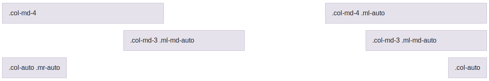

# 3.5. Espaciado entre columnas

Es posible crear un espaciado entre las columnas o dicho de otra forma, mover o desplazar una columna **hacia la derecha**, añadiendo un _offset_ inicial mediante las clases: `.offset-*`. Por ejemplo `.offset-4` creará un espacio a la izquierda de la columna de tamaño 4 (como si se creara una columna oculta de tipo `.col-4`). En el siguiente código podemos ver un ejemplo más completo:

```html
<div class="row">
  <div class="col-md-4">.col-md-4</div>
  <div class="col-md-4 offset-md-4">.col-md-4 .offset-md-4</div>
</div>
<div class="row">
  <div class="col-md-3 offset-md-3">.col-md-3 .offset-md-3</div>
  <div class="col-md-3 offset-md-3">.col-md-3 .offset-md-3</div>
</div>
<div class="row">
  <div class="col-md-6 offset-md-3">.col-md-6 .offset-md-3</div>
</div>
```

El cual se renderizaría de la forma:


Como se puede ver en el ejemplo anterior, también podemos especificar el offset según el tamaño de pantalla. Si usamos, por ejemplo, la clase "`offset-4`" estaremos indicando que se cree un espacio de 4 para **todos** los tamaños de pantalla; mientras que con "`offset-md-4`" se creará este espacio a partir del tamaño de pantalla "md" en adelante.

Si en algún caso necesitamos eliminar el _offset_ podemos utilizar el tamaño cero (0). Por ejemplo, si especificamos un _offset_ de 2 para tamaños pequeños y no queremos que dicho _offset_ se aplique para pantallas medianas ni grandes tendríamos que hacer:

```html
<div class="col-sm-5 offset-sm-2 col-md-7 offset-md-0">...</div>
```

## Márgenes

Además de la clase _offset_ también disponemos de las clases para crear márgenes de espacio variable tanto al lado izquierdo (con "`.ml-auto`") como al lado derecho (con `.mr-auto`) de una columna. A continuación se incluye un ejemplo:

```html
<div class="row">
  <div class="col-md-4">.col-md-4</div>
  <div class="col-md-4 ml-auto">.col-md-4 .ml-auto</div>
</div>
<div class="row">
  <div class="col-md-3 ml-md-auto">.col-md-3 .ml-md-auto</div>
  <div class="col-md-3 ml-md-auto">.col-md-3 .ml-md-auto</div>
</div>
<div class="row">
  <div class="col-auto mr-auto">.col-auto .mr-auto</div>
  <div class="col-auto">.col-auto</div>
</div>
```

Con lo que obtendríamos el siguiente resultado:



Como se puede ver, en la primera fila se crea un marge automático por la izquierda (y para todos los tamaños) de la segunda columna, lo que provoca el desplazamiento de esta hasta alinearla a la derecha. En la segunda fila se añade margen por la izquierda a las dos columnas para tamaños de pantalla de "md" en adelante. Y en la última fila se crea un margen automático por la derecha de la primera columna (para todos los tamaños), esto provoca un efecto similar al obtenido en la primera fila.
