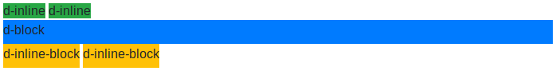

# 4. Utilidades _Responsive_

Bootstrap también incluye una serie de clases para ayudarnos a mostrar u ocultar contenidos según el tamaño del dispositivo. En primer lugar vamos a ver las clases base que utlizaremos para estas acciones:

- `.d-none`: **Oculta** el elemento sobre el que se aplique.
- `.d-inline`: **Muestra** el elemento de forma "inline", es decir, permitiendo otros elementos por los lados y ocupando el ancho justo.
- `.d-block`: **Muestra** el elemento en forma de bloque, ocupando todo el ancho disponible y sin permitir otros elementos por los lados.
- `.d-inline-block:` **Muestra** el elemento en forma de bloque, pero ocupando el ancho justo y permitiendo otros elementos por los lados.

A continuación podemos ver un ejemplo del efecto obtenido al aplicar las distintas etiquetas de las que disponemos para mostrar elementos:

La diferencia entre las etiquetas "`d-inline"` y "`d-inline-block`" es el comportamiento de bloque que adopta el elemento, el cual respetará todos los márgenes y alguras que le indiquemos.

Al aplicar estas etiquetas sobre un elemento lo mostraremos u ocultaremos **para todos los tamaños**, sin embargo, si queremos podemos añadirles modificadores para indicar el tamaño **a partir del cual** queremos que se muestren u oculten. En este último caso tendremos que añadir el tamaño de pantalla entre el prefijo "`d-`" y el sufijo `none`, `inline`, `block` o `inline-block`, es decir, siguiendo el patrón "`d-*-*`". Por ejemplo, podremos indicar `d-sm-none` para que se oculte a partir del tamaño pequeño de pantalla, `d-xl-none` para que se oculte para las pantallas extra granes, o `d-md-block` para que se muestre en forma de bloque a partir del tamaño `md`.

Es importante que nos fijemos que estas utilidades _responsive_ se aplicarán a partir del tamaño indicado en adelante, sin embargo, ¿cómo podríamos hacer para que solamente se oculte o se muestre para un tamaño de pantalla? Para esto podemos **combinar varias clases**, por ejemplo, para que solo se oculte para el tamaño extra pequeño tendríamos que poner "`d-none d-sm-block`", o para que solo se muestre para el tamaño pequeño usaríamos "`d-none d-sm-block d-md-none`".

A continuación se incluye una tabla resumen de las etiquetas que tendríamos que aplicar para mostrar u ocultar solamente para un tamaño de pantalla:

| Tamaños de pantalla                         | Mostrar                        | Ocultar                 |
| :------------------------------------------ | :----------------------------- | :---------------------- |
| Solo para tamaños extra pequeños            | `d-block d-sm-none`            | `d-none d-sm-block`     |
| Solo para tamaños pequeños (sm)             | `d-none d-sm-block d-md-none`  | `d-sm-none d-md-block`  |
| Solo para tamaños medianos (md)             | `d-none d-md-block d-lg-none`  | `d-md-none d-lg-block`  |
| Solo para tamaños grandes (lg)              | `d-none d-lg-block d-xl-none`  | `d-lg-none d-xl-block`  |
| Solo para tamaños extra grandes (xl)        | `d-none d-xl-block d-xxl-none` | `d-xl-none d-xxl-block` |
| Solo para tamaños extra extra grandes (xxl) | `d-none d-xxl-block`           | `d-xxl-none`            |
