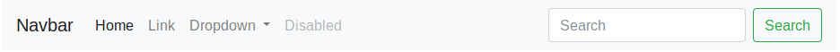
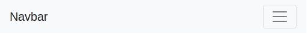
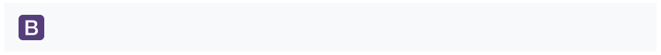
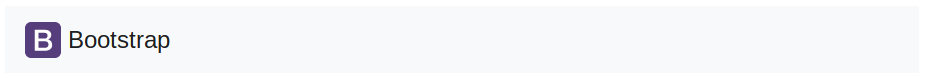
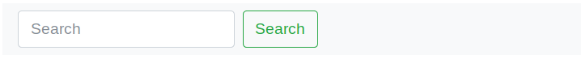
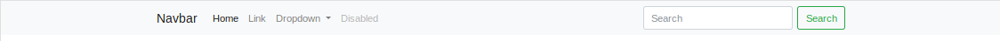
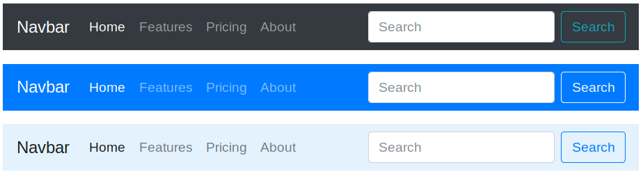

# 6.6. Barra de navegación

Bootstrap nos facilita la creación de la barra principal de navegación de nuestra web mediante la clase `.navbar`. Esta barra se adaptará al tamaño de pantalla, mostrando los elementos colapsados en un botón en pantallas pequeñas y de forma normal para pantallas más grandes.

Para añadir esta barra a nuestro sitio web utilizaremos la etiqueta "`<nav>`", que es la etiqueta de HTML 5 que identifica un elemento de navegación. En caso de no usar esta etiqueta también podemos crear la barra de navegación usando un "`<div>`", pero en este caso tendremos que añadir el atributo `role="navigation"` por cuestiones de accesibilidad. Además, en esta etiqueta también añadiremos dos etiquetas para indicar el estilo y los colores a aplicar con "`.navbar-light .bg-light`" (más adelante veremos qué otros colores podemos usar), y la etiqueta `.navbar-expand-lg` para indicar el tamaño a partir del cual la barra se mostrará de forma expandida. La etiqueta `.navbar-expand-lg` indica que la barra se mostrará en su tamaño completo a partir del tamaño de pantalla grande (lg), colapsándose para tamaños más pequeños. Este sería el comportamiento por defecto, pero si queremos lo podemos modificar cambiando el tamaño "lg" por otro de los posibles tamaños definidos por Bootstrap: "`sm`", "`md`", "`lg`", "`xl`" o "`xxl`".

Dentro de la etiqueta "`<nav>`" el contenido de la barra estará dividido en tres secciones:

- Nombre o logotipo de la web, marcado con la etiqueta "`.navbar-brand`".
- Botón toggler marcado con "`.navbar-toggler`", que se mostrará únicamente cuando el menú se colapse y se ocultará cuando el menú aparezca expandido. Cuando sea visible podremos pulsar sobre él para mostrar u ocultar el menú.
- Las opciones de menú, las cuales las añadiremos dentro de una lista tipo "`<ul>`" con la clase "`.navbar-nav`". Además, esta lista la tendremos que meter dentro de una caja "`<div>`" con las clases "`.collapse .navbar-collapse`", que definirá la zona que se colapsará (u ocultará) para pantallas pequeñas.
  - Cada elemento de la lista de menú `<ul>` se definirá mediante una etiqueta "`<li>`" sobre la que aplicaremos la clase "`.nav-item`". Además, como ya veremos más adelante, podremos añadir otros elementos dentro de las opciones de menú, como por ejemplo un formulario.

A continuación se incluye un ejemplo completo de una barra de navegación:

```html
<nav class="navbar navbar-expand-lg navbar-light bg-light">
  <div class="container-fluid">
    <a class="navbar-brand" href="#">Navbar</a>

    <button
      class="navbar-toggler"
      type="button"
      data-bs-toggle="collapse"
      data-bs-target="#navbarSupportedContent"
      aria-controls="navbarSupportedContent"
      aria-expanded="false"
      aria-label="Toggle navigation"
    >
      <span class="navbar-toggler-icon"></span>
    </button>

    <div class="collapse navbar-collapse" id="navbarSupportedContent">
      <ul class="navbar-nav me-auto mb-2 mb-lg-0">
        <li class="nav-item">
          <a class="nav-link active" aria-current="page" href="#">Home</a>
        </li>

        <li class="nav-item">
          <a class="nav-link" href="#">Link</a>
        </li>

        <li class="nav-item dropdown">
          <a
            class="nav-link dropdown-toggle"
            href="#"
            id="navbarDropdown"
            role="button"
            data-bs-toggle="dropdown"
            aria-expanded="false"
          >
            Dropdown
          </a>
          <ul class="dropdown-menu" aria-labelledby="navbarDropdown">
            <li><a class="dropdown-item" href="#">Action</a></li>
            <li><a class="dropdown-item" href="#">Another action</a></li>
            <li><hr class="dropdown-divider" /></li>
            <li><a class="dropdown-item" href="#">Something else here</a></li>
          </ul>
        </li>

        <li class="nav-item">
          <a class="nav-link disabled">Disabled</a>
        </li>
      </ul>

      <form class="d-flex">
        <input
          class="form-control me-2"
          type="search"
          placeholder="Search"
          aria-label="Search"
        />
        <button class="btn btn-outline-success" type="submit">Search</button>
      </form>
    </div>
  </div>
</nav>
```

Si añadimos este código a nuestro sitio Web y lo visualizamos con un navegador, obtendremos el siguiente resultado cuando lo visualicemos en pantallas medianas y grandes:



En las pantallas pequeñas los elementos de navegación se colapsarían en un botón (_toggler_), de la forma:



## Imagen en la barra de navegación

Para incluir el logotipo de nuestra web en la barra de navegación tenemos que modificar la sección `navbar-brand` del ejemplo anterior para incluir la etiqueta ``, de la forma:

```html
<nav class="navbar navbar-expand-lg navbar-light bg-light">
  <div class="container-fluid">
    <a class="navbar-brand" href="#">
      
    </a>
    ...
  </div>
</nav>

<!-- O si queremos incluir un logotipo y texto... -->
<nav class="navbar navbar-expand-lg navbar-light bg-light">
  <div class="container-fluid">
    <a class="navbar-brand" href="#">
      
      Bootstrap
    </a>
    ...
  </div>
</nav>
```

Con lo que obtendríamos los siguiente resultados, en el primer caso se mostraría el logotipo





> Es posible que sea necesario añadir o modificar los estilos para disponer correctamente la imagen en la barra de navegación.

## Barra de navegación con formulario

Podemos añadir formularios a nuestra barra de navegación utilizando el tipo de formulario inline, definido con "`.form-inline`" como vimos en la sección "Formularios", por ejemplo:

```html
<nav class="navbar navbar-light bg-light">
  <div class="container-fluid">
    ...
    <form class="d-flex">
      <input
        class="form-control me-2"
        type="search"
        placeholder="Search"
        aria-label="Search"
      />
      <button class="btn btn-outline-success" type="submit">Search</button>
    </form>
  </div>
</nav>
```

Obteniendo:



<!--
### Alineación

Para modificar la alineación del formulario podemos utilizar las clases que vimos en la sección "Alineación horizontal" dentro del "Sistema de rejilla", como por ejemplo "`.justify-content-between`":

```html
<nav class="navbar navbar-light bg-light justify-content-between">
  <a class="navbar-brand">Navbar</a>
  <form class="form-inline">
    <input class="form-control mr-sm-2" type="search" placeholder="Search" aria-label="Search">
    <button class="btn btn-outline-success my-2 my-sm-0" type="submit">Search</button>
  </form>
</nav>
```

Que produciría que el formulario se alenee a la derecha:


-->

## Anclajes de la barra de navegación

Bootstrap nos permite anclar o fijar la posición de la barra de tres formas distintas: fijarla a la parte superior añadiendo la clase `.fixed-top` a la etiqueta nav, fijarla a la parte inferior con `.fixed-bottom`, o usar el modo sticky (o pegajoso) con la etiqueta `.sticky-top`, el cual anclará la barra a la parte superior mientras se realiza scroll y cuando se alcanza el tope permanecerá fija. A continuación se incluye un ejemplo de cada uno de estos modos:

```html
<!-- Fixed top -->
<nav class="navbar fixed-top navbar-light bg-light">...</nav>

<!-- Fixed bottom -->
<nav class="navbar fixed-bottom navbar-light bg-light">...</nav>

<!-- Sticky top -->
<nav class="navbar sticky-top navbar-light bg-light">...</nav>
```

En los modos "`.fixed-top`" y "`.fixed-bottom`", dado que la barra se colocará de forma "flotante" sobre el contenido, es posible que oculte una parte del mismo. Para solucionar esto es necesario añadir un pequeño espaciado superior o inferior a la etiqueta `<body>`. El alto de la barra es de 50px, por lo que se suele recomendar un espaciado de 70px, de la forma:

```
body { padding-top: 70px; }  /* En el caso de .fixed-top */
body { padding-bottom: 70px; }  /* En el caso de .fixed-bottom */
```

<!--
## Contenedores

Aunque no es completamente necesario, sí que se recomienda añadir un elemento contenedor a la barra. El cual podrá añadirse de dos formas: un contenedor externo que incluya toda la barra, o un contenedor interno que incluya solo los elementos de la barra. A continuación se incluyen ambos ejemplos:

```html
<!-- Contenedor externo -->
<div class="container">
  <nav class="navbar navbar-expand-lg navbar-light bg-light">
    <a class="navbar-brand" href="#">Navbar</a>
  </nav>
</div>

<!-- Contenedor interno -->
<nav class="navbar navbar-expand-lg navbar-light bg-light">
  <div class="container">
    <a class="navbar-brand" href="#">Navbar</a>
  </div>
</nav>
```

El resultado obtenido solo difiere para los tamaños de pantalla grandes, en los cuales, en el primer caso la barra aparecerá centrada (y el color de la barra solo se aplicará en el espacio central), y en el segundo caso la barra ocupará todo el ancho posible (por lo que el color de aplicará en todo el ancho) pero los elementos de la barra aparecerán centrados. A continuación se incluye un ejemplo de los dos casos:



-->

## Colores de la barra de navegación

Podemos personalizar el color de la barra y los elementos que la componen de una forma muy sencilla. En primer lugar tendremos que elegir entre el tema claro (`.navbar-light`) o el tema oscuro (`.navbar-dark`), y además asignar un color de fondo con las clases `.bg-*` para personalizar el color (a continuación se incluye la lista de colores posibles). Por ejemplo podríamos modificar la barra de navegación de las siguientes formas:

```html
<nav class="navbar navbar-dark bg-dark">
  <!-- ... -->
</nav>

<nav class="navbar navbar-dark bg-primary">
  <!-- ... -->
</nav>

<nav class="navbar navbar-light" style="background-color: #e3f2fd;">
  <!-- ... -->
</nav>
```

Con lo que obtendríamos los siguientes resultados:



Los posibles colores que podemos elegir como fondo para la barra de navegación son los siguientes: `.bg-primary`, `.bg-secondary`, `.bg-success`, `.bg-danger`, `.bg-warning`, `.bg-info`, `.bg-light`, `.bg-dark` y `.bg-white`. Además de poder aplicarlo sobre la barra de navegación también se pueden utilizar para definir el color de fondo de cualquier otro elemento. A continuación se incluye una imagen de estos colores:


