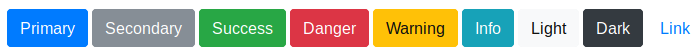
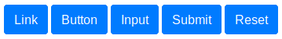
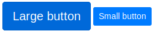

# Botones

Mediante la clase `.btn` podemos aplicar estilo a los elementos tipo `button`. Esta clase la podemos combinar con `.btn-primary`, `.btn-secondary`, `.btn-success`, `.btn-danger`, `.btn-warning`,  `.btn-info`, `.btn-light`, `.btn-dark` o `.btn-link` para crear botones para diferentes estados o acciones en nuestros formularios:

```html
<button type="button" class="btn btn-primary">Primary</button>
<button type="button" class="btn btn-secondary">Secondary</button>
<button type="button" class="btn btn-success">Success</button>
<button type="button" class="btn btn-danger">Danger</button>
<button type="button" class="btn btn-warning">Warning</button>
<button type="button" class="btn btn-info">Info</button>
<button type="button" class="btn btn-light">Light</button>
<button type="button" class="btn btn-dark">Dark</button>
<button type="button" class="btn btn-link">Link</button>
```

Con lo que ontendríamos el siguiente resultado:



## Elementos tipo botón

Estas clases no son exclusivas para las etiquetas `button` sino que también funcionarán de la misma forma con `<a>` y `<input>`:

```html
<a class="btn btn-primary" href="#" role="button">Link</a>
<button class="btn btn-primary" type="submit">Button</button>
<input class="btn btn-primary" type="button" value="Input">
<input class="btn btn-primary" type="submit" value="Submit">
<input class="btn btn-primary" type="reset" value="Reset">
```

Obteniendo en todos los casos botones con la misma apariencia:



## Tamaño de los botones

Podemos variar el tamaño de los botones simplemente añadiendo las clases `.btn-lg`, `.btn-sm` o `.btn-block`, para obtener botones con un tamaño más grande, más pequeño, o un botón que ocupe todo el ancho. Por ejemplo, con el siguiente código:

```html
<button type="button" class="btn btn-primary btn-lg">Large button</button>
<button type="button" class="btn btn-primary btn-sm">Small button</button>
<button type="button" class="btn btn-primary btn-block">Block button</button>
```

Obtendríamos el siguiente resultado:



