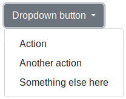
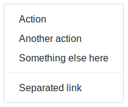

# Desplegables

Bootstrap nos facilita la creación de botones con listas de opciones desplegables mediante la clase `.dropdown`. Este elemento requiere que el _plugin_ JavaScript de Bootstrap esté incluido en la plantilla. La estructura básica para crear un elemento de este tipo es la siguiente:

```html
<div class="dropdown">
  <button class="btn btn-secondary dropdown-toggle" type="button" id="dropdownMenuButton" data-toggle="dropdown" aria-haspopup="true" aria-expanded="false">
    Dropdown button
  </button>
  <div class="dropdown-menu" aria-labelledby="dropdownMenuButton">
    <a class="dropdown-item" href="#">Action</a>
    <a class="dropdown-item" href="#">Another action</a>
    <a class="dropdown-item" href="#">Something else here</a>
  </div>
</div>
```

Con lo que obtendríamos el siguiente resultado:



Sobre el botón principal podemos aplicar todos los colores de botones que hemos visto en la sección titulada "Botones", por ejemplo "`.btn-success`" o "`.btn-danger`". También podemos añadir los modificadores de tamaño "`.btn-lg`" y "`.btn-sm`" para aumentar o disminuir el tamaño del botón del desplegable.

Si nos fijamos en el código anterior, para el botón principal se ha usado la etiqueta "`button`" y para los elementos del desplegable la etiqueta "`a`", sin embargo podríamos haber usado solamente la etiqueta "`a`" o solamente la etiqueta "`button`", es decir, funcionan exactamente igual y su apariencia es la misma.

> Los atributos que empiezan con "aria" son para crear contenido accesible, para que los lectores de pantalla pueden encontrar las etiquetas correctas a la hora de interpretar el contenido. Para más información consultar la documentación sobre HTML 5 ARIA.

Para alinear un menú a la derecha se puede añadir la clase `.dropdown-menu-right` a la lista "`dropdown-menu`", por ejemplo:

```html
<div class="dropdown-menu dropdown-menu-right">
```


## Encabezados en un desplegable

Para añadir un encabezado (o varios) y dividir en secciones un desplegable podemos utilizar la clase `.dropdown-header` de la siguiente forma:

```html
<div class="dropdown-menu">
  <h6 class="dropdown-header">Dropdown header</h6>
  <a class="dropdown-item" href="#">Action</a>
  <a class="dropdown-item" href="#">Another action</a>
</div>
```

Con lo que obtendremos:


## Separadores en un desplegable

También podemos añadir separadores en un desplegable mediante la clase `.dropdown-divider` de la forma:

```html
<div class="dropdown-menu">
  <a class="dropdown-item" href="#">Action</a>
  <a class="dropdown-item" href="#">Another action</a>
  <a class="dropdown-item" href="#">Something else here</a>
  <div class="dropdown-divider"></div>
  <a class="dropdown-item" href="#">Separated link</a>
</div>
```

Con lo que obtendríamos el siguiente listado con separador:



