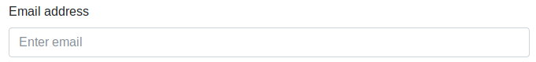
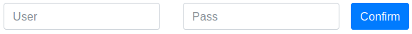
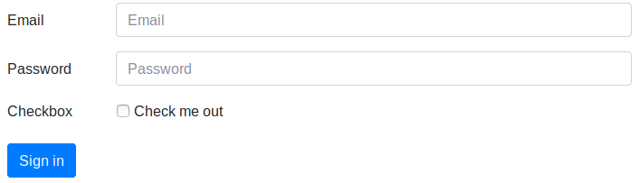
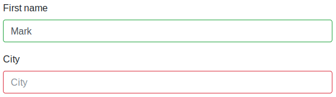
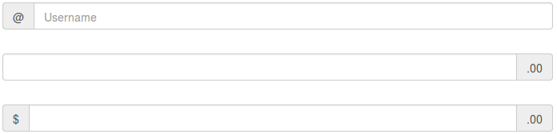

# Formularios

Bootstrap aplica estilos a los elementos de tipo formulario para convertirlos en elementos responsive, mejorar su apariencia y permitirnos crear diferentes alineaciones. La estructura básica de un formulario es la siguiente:

```html
<form>
  <div class="form-group">
    <label for="exampleInputEmail1">Email address</label>
    <input type="email" class="form-control" id="exampleInputEmail1"
           aria-describedby="emailHelp" placeholder="Enter email">
  </div>
</form>
```

Con lo que obtendríamos un formulario** en vertical** como el de la siguiente figura, es decir, los elementos del formulario se dispondrán en vertical, unos debajos de otros.



Para permitir que Bootstrap ajuste correctamente el espaciado, cada bloque o grupo de un formulario (normalmente formado por una etiqueta `label` y algún elemento de entrada de datos como un _input_, _textarea_, etc.) tendrá que estar agrupado por una caja contenedora con la clase `.form-group`. Además a cada _input_ se le tiene que aplicar la clase `.form-control`.

Bootstrap sobrecarga y aplica estilos a los principales elementos de formulario definidos en HTML 5, como son: _text, password, datetime, datetime-local, date, month, time, week, number, email, url, search, tel_ y _color_.

## Formulario _inline_

Mediante la utilización de la clase `.form-inline` sobre la etiqueta `<form>` podemos crear formularios que se dispondrán en una sola línea. A continuación se incluye un ejemplo de este tipo de formularios:

```html
<form class="form-inline">
   <div class="form-group mx-sm-3">
       <label for="inputUser" class="sr-only">User</label>
       <input type="password" class="form-control" id="inputUser" placeholder="User">
   </div>
   <div class="form-group mx-sm-3">
       <label for="inputPass" class="sr-only">Password</label>
       <input type="password" class="form-control" id="inputPass" placeholder="Pass">
   </div>
   <button type="submit" class="btn btn-primary">Confirm</button>
</form>
```

Obteniendo el siguiente resultado:



> Aunque los campos del formulario no contengan etiquetas (_labels_) es necesario incluirlas por cuestiones de accesibilidad, para dar soporte a los lectores de pantalla. Por este motivo se han incluido en el ejemplo anterior con la clase `.sr-only` (_screen readers only_).
>
> Esta alineación tipo "inline" solo será visible para pantallas grandes. En pantallas pequeñas los elementos cambiarán a alineación vertical.
>
> En el ejemplo se ha añadido la etiqueta ".mx-sm-3" para crear un pequeño margen en los laterales de cada elemento del formulario. Para más información sobre este tipo de etiquetas consultad la documentación oficial.

## Formulario horizontal

Mediante el uso del sistema de rejilla de Bootstrap podemos crear formularios con disposición en horizontal. Para esto tendremos que crear una fila (`.row`) por cada grupo, y situar la etiqueta y el input cada uno en una columna. A continuación se incluye un ejemplo:

```html
<form>
  <div class="form-group row">
    <label for="inputEmail3" class="col-sm-2 col-form-label">Email</label>
    <div class="col-sm-10">
      <input type="email" class="form-control" id="inputEmail3" placeholder="Email">
    </div>
  </div>
  <div class="form-group row">
    <label for="inputPassword3" class="col-sm-2 col-form-label">Password</label>
    <div class="col-sm-10">
      <input type="password" class="form-control" id="inputPassword3" placeholder="Password">
    </div>
  </div>
  <div class="form-group row">
    <div class="col-sm-2">Checkbox</div>
    <div class="col-sm-10">
      <div class="form-check">
    <label class="form-check-label">
      <input class="form-check-input" type="checkbox"> Check me out
    </label>
      </div>
    </div>
  </div>
  <div class="form-group row">
    <div class="col-sm-10">
      <button type="submit" class="btn btn-primary">Sign in</button>
    </div>
  </div>
</form>
```

Con lo que obtendríamos:



Es importante que nos fijemos que la etiqueta `.row` se añade al `div` de cada grupo, manteniendo también la etiqueta "`.form-group`". Además, podemos aplicar la clase de las columnas para las etiquetas `label` directamente sobre dicho elemento, sin necesidad de crear una caja contenedora.

## Estados de validación de un formulario

Bootstrap también incluye clases para aplicar diferentes estados de validación a un formulario. Para utilizarlo simplemente tenemos que añadir las clases: `.is-valid` o  `.is-invalid` sobre el propio input. De esta forma, el color de los elementos del formulario cambiará. A continuación podemos ver un ejemplo:

```html
<form>
  <div class="form-group">
      <label for="validation01">First name</label>
      <input type="text" class="form-control is-valid" id="validation01"
             placeholder="First name" value="Mark" required>
  </div>
  <div class="form-group">
      <label for="validation02">City</label>
      <input type="text" class="form-control is-invalid" id="validation02" placeholder="City" required>
  </div>
</form>
```

Que se mostraría de la forma:



## Agrupar _inputs_ con otros elementos

Podemos añadir texto o botones al principio, final o a ambos lados de campo tipo `<input>`. Para esto tenemos que agrupar dicho _input_ dentro de un `.input-group` y añadir dentro del grupo el elemento que queremos agrupar con la etiqueta `.input-group-addon`. A continuación se incluye un ejemplo:

```html
<div class="input-group">
  <span class="input-group-addon">@</span>
  <input type="text" class="form-control" placeholder="Username">
</div>

<div class="input-group">
  <input type="text" class="form-control">
  <span class="input-group-addon">.00</span>
</div>

<div class="input-group">
  <span class="input-group-addon">$</span>
  <input type="text" class="form-control">
  <span class="input-group-addon">.00</span>
</div>
```

Con lo que obtendríamos el siguiente resultado:



