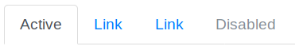
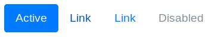
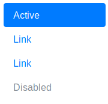
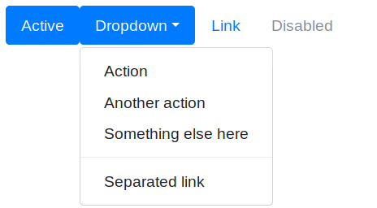

# Navegación

Los elementos de navegación de Bootstrap comparten la etiqueta `.nav` para su marcado en la clase contenedora. Estos elementos necesitan la librería JavaScript para su correcto funcionamiento. Algunos de los elementos de navegación que podemos utilizar son las fichas o pestañas y las "píldoras".

## Fichas o pestañas

Mediante la clase `.nav-tabs` podemos crear un grupo de pestañas o fichas, para ello tenemos que seguir la siguiente estructura:

```html
<ul class="nav nav-tabs">
  <li class="nav-item">
    <a class="nav-link active" href="#">Active</a>
  </li>
  <li class="nav-item">
    <a class="nav-link" href="#">Link</a>
  </li>
  <li class="nav-item">
    <a class="nav-link" href="#">Link</a>
  </li>
  <li class="nav-item">
    <a class="nav-link disabled" href="#">Disabled</a>
  </li>
</ul>
```

Es importante que nos fijemos en cómo se usan las clases CSS `.nav`, `.nav-tabs`, `.nav-item` y `.nav-link`. Cada elemento del menú será un `.nav-item`, los cuales contienen un enlace tipo `.nav-link` a la sección a mostrar. Para marcar el elemento del menú que está activo o seleccionado se utiliza la clase `.active`.  Además disponemos de la clase `.disabled` para deshabilitar elementos del menú.

Si visualizamos el código de ejemplo anterior obtendríamos un menú en forma de pestañas como el siguiente:



## _Píldoras_

La clase `.nav-pills` se define de igual forma que la `.nav-tab` pero sus elementos adoptarán una apariencia más similar a botones o "píldoras":

```html
<ul class="nav nav-pills">
  <li class="nav-item">
    <a class="nav-link active" href="#">Active</a>
  </li>
  <li class="nav-item">
    <a class="nav-link" href="#">Link</a>
  </li>
  <li class="nav-item">
    <a class="nav-link" href="#">Link</a>
  </li>
  <li class="nav-item">
    <a class="nav-link disabled" href="#">Disabled</a>
  </li>
</ul>
```

En este caso el aspecto del menú sería el siguiente:



También podemos crear un menú vertical o apilado añadiendo la clase `.flex-column` a la etiqueta contenedora:

```html
<ul class="nav nav-pills flex-column">
  <li class="nav-item">
    <a class="nav-link active" href="#">Active</a>
  </li>
  <li class="nav-item">
    <a class="nav-link" href="#">Link</a>
  </li>
  <li class="nav-item">
    <a class="nav-link" href="#">Link</a>
  </li>
  <li class="nav-item">
    <a class="nav-link disabled" href="#">Disabled</a>
  </li>
</ul>
```

Obteniendo:



### Ancho justificado

También podemos indicar que el ancho de las pestañas o de las píldoras se distribuya equitativamente según el ancho disponible. Para esto simplemente tenemos que aplicar la clase `.nav-fill` a la etiqueta contenedora, de la forma:

```html
<ul class="nav nav-pills nav-fill">
  <li class="nav-item">
    <a class="nav-link active" href="#">Active</a>
  </li>
  <li class="nav-item">
    <a class="nav-link" href="#">Longer nav link</a>
  </li>
  <li class="nav-item">
    <a class="nav-link" href="#">Link</a>
  </li>
  <li class="nav-item">
    <a class="nav-link disabled" href="#">Disabled</a>
  </li>
</ul>
```

Con lo que obtendríamos:


> Este estilo no funcionará para pantallas con un ancho menor a 768px, que son las pantallas definidas como extra pequeñas o de _smartphone_. Para estos tamaños cada elemento del menú ocupará el ancho justo que necesite.

### Elementos de navegación con desplegables

También podemos añadir elementos desplegables a nuestros menús de navegación, tanto al de tipo tabs como al de píldoras. Para esto simplemente añadiremos el dropdown como un elemento del menú más, usando la notación que vimos en la sección "Desplegables", pero llevan cuidado de que para la etiqueta incicial (que en el dropdown normal era "`<div class="dropdown">`") se utilice el propio elemento "`.nav-item`" del menú, añadiendo la clase "`.dropdown`" de la forma: "`<li class="nav-item dropdown">`". A continuación se incluye un ejemplo completo:

```html
<ul class="nav nav-tabs">
  <li class="nav-item">
    <a class="nav-link active" href="#">Active</a>
  </li>
  <li class="nav-item dropdown">
    <a class="nav-link dropdown-toggle" data-toggle="dropdown" href="#" role="button"
       aria-haspopup="true" aria-expanded="false">Dropdown</a>
    <div class="dropdown-menu">
      <a class="dropdown-item" href="#">Action</a>
      <a class="dropdown-item" href="#">Another action</a>
      <a class="dropdown-item" href="#">Something else here</a>
      <div class="dropdown-divider"></div>
      <a class="dropdown-item" href="#">Separated link</a>
    </div>
  </li>
  <li class="nav-item">
    <a class="nav-link" href="#">Link</a>
  </li>
  <li class="nav-item">
    <a class="nav-link disabled" href="#">Disabled</a>
  </li>
</ul>
```

Con lo que obtendríamos un resultado como el de la siguiente figura:



