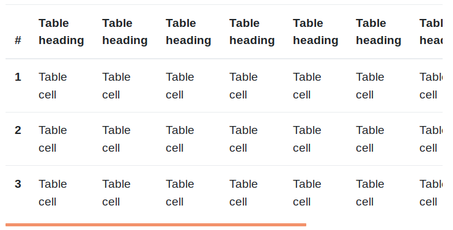

# Tablas

Bootstrap también define una serie de clases para aplicar estilos sobre las tablas de HTML. La más básica es la clase `.table`:

```html
<table class="table">
  ...
</table>
```

La cual configura los estilos de las tablas básicas de HTML para que adopten el siguiente aspecto:


En la tabla anterior las celdas de la primera fila estarían marcadas con "th" y el resto de celdas con "td".


## Tablas pequeñas

Si queremos compactar el tamaño de la tabla para que deje un padding (o espaciado interior) inferior, podemos aplicar la clase `.table-sm` de la forma:

```html
<table class="table table-sm">
    ...
</table>
```

Obteniendo:


## **Colores alternos**

Si además aplicamos la clase `.table-striped` a nuestra tabla conseguiremos que las filas presenten colores alternos:

```html
<table class="table table-striped">
  ...
</table>
```

Con lo que obtendríamos una tabla con el siguiente aspecto:


## **Tablas con bordes**

También podemos dibujar un borde al rededor de la tabla añadiendo la clase `.table-bordered`, de la forma:

```html
<table class="table table-bordered">
  ...
</table>
```

Obteniendo el siguiente resultado:


## **Tablas **_**Responsive**_

Bootstrap proporciona una forma de crear tablas _responsive_ que se basa en crear un _scroll_ horizontal para que se vean correctamente. Para que esto funcione simplemente tenemos que añadir la etiqueta `.table-responsive` a la propia tabla:

```html
<table class="table table-responsive">
  ...
</table>
```

Obteniendo:



Este efecto se aplicará únicamente sobre dispositivos pequeños (`<576px`) mientras que en el resto de dispositivos no se notará la diferencia. Si queremos que el punto de ruptura a partir del cual se aplique el responsive sobre la tabla sea un tamaño mayor podemos indicar un sufijo de tamaño sobre esta etiqueta, de la forma `.table-responsive-*`, donde "`*`" podrá ser `sm`, `md`, `lg`, `xl` o `xxl`.

