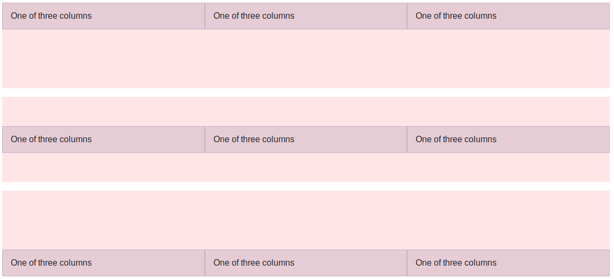
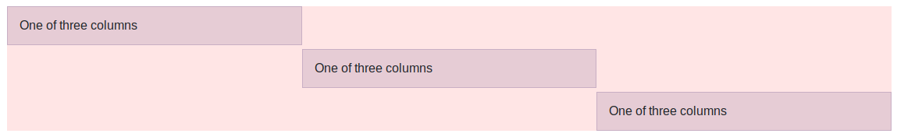
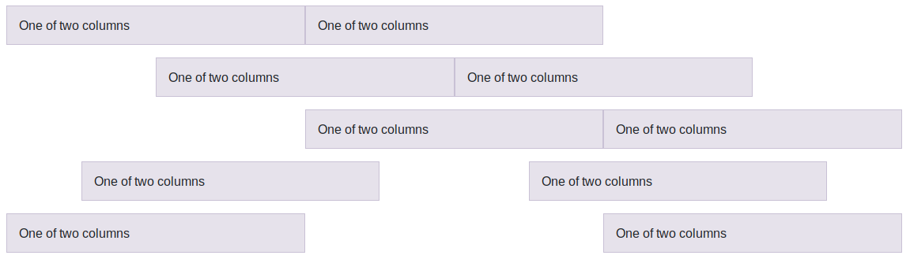

# Alineación

Con la nueva versión de Bootstrap también han aparecido nuevas clases que nos permiten especificar la alineación de las columnas tanto en horizontal como en vertical.

## Alineación vertical

Para indicar la alineación en vertical tenemos dos opciones: indicar la misma alineación para todos los elementos de una fila o indicar la alineación a nivel de columna, lo que nos permitirá establecer distintas alineaciones para cada columna.

En el primer caso la clase CSS para la alineación la tendremos que añadir a la fila usando la etiqueta "`.align-items-*`", donde "\*" podrá ser "`start`" (al principio o pegada a la parte superior de la fila), "`center`" (alineación centrada en vertical) o "`end`" (alineación pegada al final o a la parte inferior de la fila). A continuación se incluye un ejemplo de los tres tipos de alineación:

```html
<div class="container">
  <div class="row align-items-start">
    <div class="col">One of three columns</div>
    <div class="col">One of three columns</div>
    <div class="col">One of three columns</div>
  </div>
  <div class="row align-items-center">
    <div class="col">One of three columns</div>
    <div class="col">One of three columns</div>
    <div class="col">One of three columns</div>
  </div>
  <div class="row align-items-end">
    <div class="col">One of three columns</div>
    <div class="col">One of three columns</div>
    <div class="col">One of three columns</div>
  </div>
</div>
```

Con lo que obtendríamos un resultado como el de la siguiente figura:



En el segundo caso, si queremos indicar por separado la alineación vertical de cada una de las columnas de una fila, tendremos que usar la clase CSS `.align-self-*`, donde "\*" podrá adoptar los mismos valores:  `start`, `center` o `end`. A continuación se incluye un ejemplo en el que se indican los tres tipos de alineaciones dentro de una misma fila:

```html
<div class="container">
  <div class="row">
    <div class="col align-self-start">One of three columns</div>
    <div class="col align-self-center">One of three columns</div>
    <div class="col align-self-end">One of three columns</div>
  </div>
</div>
```

Con lo que obtendremos el siguiente resultado:



> Es importante destacar que al utilizar cualquierda de estas etiquetas de alineación, la altura de las columnas **se ajustará al contenido**, mientras que si no utilizamos ninguna etiqueta de alineación, la altura de la celda se **extenderá hasta ocupar todo el espacio disponible** en la fila.


## Alineación horizontal

También podemos especificar la alineación horizontal de los elementos de una fila. Para esto disponemos de la clase "`.justify-content-*`", donde "\*" podrá ser "`start`" (izquierda), "`center`" (centrado), "`end`" (derecha), "`around`" (añadirá el mismo espacio **a ambos lados** de la columna) y "`between`" (añade espacio **entre** las columnas). A continuación se incluye un ejemplo de cada uno de estos tipos de alineación horizontal:

```html
<div class="container">
  <div class="row justify-content-start">
    <div class="col-4">One of two columns</div>
    <div class="col-4">One of two columns</div>
  </div>
  <div class="row justify-content-center">
    <div class="col-4">One of two columns</div>
    <div class="col-4">One of two columns</div>
  </div>
  <div class="row justify-content-end">
    <div class="col-4">One of two columns</div>
    <div class="col-4">One of two columns</div>
  </div>
  <div class="row justify-content-around">
    <div class="col-4">One of two columns</div>
    <div class="col-4">One of two columns</div>
  </div>
  <div class="row justify-content-between">
    <div class="col-4">One of two columns</div>
    <div class="col-4">One of two columns</div>
  </div>
</div>
```

Con lo que obtendríamos un resultado similar al de la siguiente figura, con la fila alineada a la izquerda, la segunda centrada, la tercera alineada a la derecha, la cuarta con el espaciado "al rededor" (o a ambos lados) de las columnas, y la última con el espaciado entre las columnas.



## Alineación responsive

En caso de que lo necesitemos podremos añadir también el tamaño de pantalla a las distintas clases de alineación que hemos visto: `align-items-*`, `align-self-*` y `justify-content-*`. Para esto tendremos que añadir primero el tamaño de pantalla (sm, md, lg, xl o xxl), a continuación un guión (-), y después el tipo de alineación deseado (de entre los que hemos visto), por ejemplo: `align-items-md-center`, `align-self-sm-end`, `justify-content-lg-end`, etc.

Al indicar el tamaño de pantalla dicha alineación se aplicará solamente a partir de dicho tamaño en adelante, aunque también podemos indicar distintas alineaciones para un mismo campo según el tamaño de la pantalla, por ejemplo:

```html
<div class="row justify-content-center justify-content-md-start">
     ...
</div>
```

En el ejemplo anterior el contenido se alinearía de forma centrada para los tamaños de pantalla extra pequeños y pequeños, y cambiará a alineazión izquierda a partir del tamaño de pantalla "md".

