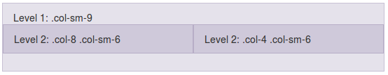

# Anidamiento de columnas

Una característica muy potente del sistema de rejilla es que se pueden anidar columnas dentro de otras columnas. Para esto solamente tenemos que crear una nueva fila dentro de una columna, y dentro de esta nueva fila podremos subdividirla usando también hasta 12 columnas.

Por ejemplo, en el siguiente código se crea una primera fila con una columna de tamaño 9, dentro de la cual se añade una segunda fila con dos columnas:

```html
<div class="row">
  <div class="col-sm-9">
    Level 1: .col-sm-9
    <div class="row">
      <div class="col-8 col-sm-6">Level 2: .col-8 .col-sm-6</div>
      <div class="col-4 col-sm-6">Level 2: .col-4 .col-sm-6</div>
    </div>
  </div>
</div>
```

Al visualizar este código obtendríamos:



