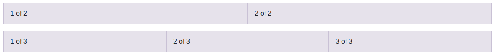
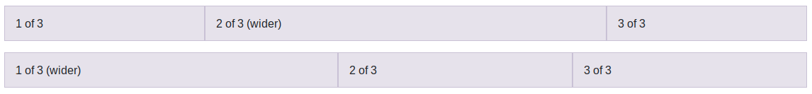

# Columnas de ancho automático

A partir de la versión 4 de Bootstrap podemos utilizar las columnas de ancho automático, es decir, indicar únicamente el número de columnas que queremos y el sistema calculará automáticamente su anchura. Para esto podremos usar **la clase "**`.col`**"**, sin número de columnas ni tamaño de pantalla, por ejemplo:

```html
<div class="container">
  <div class="row">
    <div class="col">1 of 2</div>
    <div class="col">2 of 2</div>
  </div>
  <div class="row">
    <div class="col">1 of 3</div>
    <div class="col">2 of 3</div>
    <div class="col">3 of 3</div>
  </div>
</div>
```

Con este código obtendríamos un resultado similar al de la siguiente figura, donde en primer lugar se crea una fila con dos columna de igual ancho, y a continuación se añade una segunda fila con tres columnas de igual ancho.



El número de columnas del ejemplo anterior se mantendrá para todos los tamaños de pantalla, adaptando el ancho de las columnas para cada uno de ellos.

A esta clase podemos añadir el sufijo para establecer el tamaño de pantalla, por lo que disponemos de las clases: `.col, .col-sm, .col-md, .col-lg, .col-xl` y `.col-xxl`. En todos los casos estaremos indicando que queremos una columna de ancho automático desde el tamaño de pantalla indicado en adelante. Debemos de tener en cuenta que si indicamos algo como `<div class="col col-sm col-md">` el resultado que obtendríamos sería el mismo en todos los tamaños, una columna de ancho automático, equivalente a haber indicado únicamente `<div class="col">`. Por lo tanto, el uso de estos sufijos solo se justicará cuando queramos una columna de ancho automático solamente de un tamaño en adelante, y que por lo tanto, para los tamaños inferiores se cree una columna que ocupe todo el ancho. Por ejemplo, veamos el siguiente código:

```html
<div class="row">
  <div class="col-sm">col-sm</div>
  <div class="col-sm">col-sm</div>
  <div class="col-sm">col-sm</div>
</div>
```

Estamos indicando que queremos una fila con tres columnas de ancho automático para los tamaños desde sm en adelante, y por lo tanto, para el tamaño extra pequeño estas tres columnas pasarán a ocupar todo el ancho, transformándose en tres filas completas.

## Modo mixto

Estas columnas de ancho automático se pueden mezclar **en una misma fila **con las columnas de ancho específico que hemos visto antes. La forma de calcular el ancho de cada columna será el siguiente: En primer lugar se calculará el tamaño de las columnas de ancho específico y a continuación se rellenará el espacio restante usando las columnas de ancho automático. Por ejemplo, a continuación vamos a definir dos filas mezclando ambos tipos de columnas:

```html
<div class="container">
  <div class="row">
    <div class="col">1 of 3</div>
    <div class="col-6">2 of 3 (wider)</div>
    <div class="col">3 of 3</div>
  </div>
  <div class="row">
    <div class="col-5">1 of 3 (wider)</div>
    <div class="col">2 of 3</div>
    <div class="col">3 of 3</div>
  </div>
</div>
```

Con lo que obtendríamos un resultado similar al de la siguiente figura:

Como podemos ver en este ejemplo, los sistemas para de definir las columnas **se pueden mezclar como queramos**, por ejemplo usando el de ancho fijo entre dos columnas de ancho automático, o establenciendo una columna de ancho específico al principio y después dos de ancho automático.

## Ancho de columna variable

Con Bootstrap 4 también se introdujeron las columnas de ancho variable, las cuales ocuparán el ancho justo que se necesite según el contenido de la columna. Para utilizarlas disponemos de las clases "`.col-*-auto`", donde \* puede ser culquiera de los sufijos de tamaño de pantalla que hemos visto antes _sm_, _md_, _lg_, _xl_, _xxl_, o ningún sufijo (`.col-auto`) para indicar todos los tamaños.

Estas etiquetas, igual que las de ancho automático, se pueden mezclar con las de ancho específico, por ejemplo:

```html
<div class="container">
  <div class="row justify-content-md-center">
    <div class="col col-lg-2">1 of 3</div>
    <div class="col-md-auto">Variable width content</div>
    <div class="col col-lg-2">3 of 3</div>
  </div>
  <div class="row">
    <div class="col">1 of 3</div>
    <div class="col-md-auto">Variable width content</div>
    <div class="col col-lg-2">3 of 3</div>
  </div>
</div>
```

Con lo que obtendríamos un resultado similar al de la siguiente figura:


En el código anterior se ha usado la clase "`.justify-content-md-center`" para alinear el contenido dentro de una fila, estas etiquetas las veremos en la sección "Alineación". A continuación vamos a ver otras utilidades del sistema de rejilla, como el anidamiento de columnas, o cómo forzar el cambio de fila.


