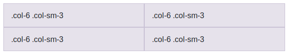

# Forzar el cambio de fila

Mediante la clase `.w-100` podemos forzar el cambio de fila cuando nosotros queramos:

```html
<div class="row">
  <div class="col-6 col-sm-3">.col-6 .col-sm-3</div>
  <div class="col-6 col-sm-3">.col-6 .col-sm-3</div>

  <!-- Force next columns to break to new line -->
  <div class="w-100"></div>

  <div class="col-6 col-sm-3">.col-6 .col-sm-3</div>
  <div class="col-6 col-sm-3">.col-6 .col-sm-3</div>
</div>
```

Con lo que obtendríamos dos filas con dos columnas cada una:



Esta clase también nos puede ser útil para forzar el cambio de fila solo para determinados tamaños de pantalla. Para esto tenemos que combinarla con otras clases de Bootstrap que nos permiten mostrar u ocultar elementos según el tamaño de pantalla. A continuación se incluye un ejemplo:

```html
<div class="row">
  <div class="col-6 col-sm-3">.col-6 .col-sm-3</div>
  <div class="col-6 col-sm-3">.col-6 .col-sm-3</div>

  <!-- Force next columns to break to new line at md breakpoint and up -->
  <div class="w-100 d-none d-md-block"></div>

  <div class="col-6 col-sm-3">.col-6 .col-sm-3</div>
  <div class="col-6 col-sm-3">.col-6 .col-sm-3</div>
</div>
```

Donde la clase "`.d-none`" significa que no se muestre ese elemento (para ningún tamaño), y la clase "`.d-md-block`" indica que se muestre a partir del tamaño de pantalla "_md_" en adelante. Por lo tanto, el campo div marcado con "w-100" permanecerá oculto para los tamaños extra pequeño y pequeño, y por lo tanto no se activará el cambio de fila para esos dos tamaños, pero sí para los tamaños desde "md" en adelante.

En la sección "Utilidades Responsive" se explicarán las etiquetas ".d-\*" que nos permirán controlar la visibilidad de cualquier elemento HTML en función del tamaño de pantalla.

