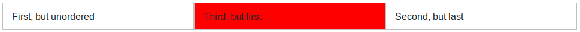
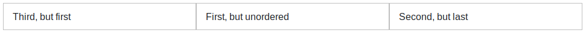

# Ordenación de columnas

También podemos modificar el orden visual de las columnas mediante la clase `.order-`. Esta clase permite  indicar la posición a la cual queremos desplazar la columna (del 1 al 12, por ejemplo `.order-1`, `.order-2`, etc.). También podemos especificar el tamaño de pantalla para el que queremos que se aplique (por ejemplo `.order-md-12`). A continuación se incluye un ejemplo:

```html
<div class="container">
  <div class="row">
    <div class="col">First, but unordered</div>
    <div class="col order-12">Second, but last</div>
    <div class="col order-1">Third, but first</div>    <!-- ¡¡CUIDADO!! -->
  </div>
</div>
```

Obteniendo como resultado:



Si nos fijamos en el resultado obtenido podemos ver que **no** se obtiene el resultado esperado, la tercera columna (en color rojo) aparece en la segunda posición en lugar de en la primera como se había indicado con "`order-1`". Esto es debido a un pequeño error al cambiar el orden de derecha izquierda. En los casos en los que simplemente queramos mover una columna hacia la derecha no se producirá este error, **pero si queremos mover hacia la izquierda será necesario que establezcamos el order de todas las columnas.** Por lo tanto, para que funcione correctamente el ejemplo anterior tendríamos que escribir el siguiente código:

```html
<div class="container">
  <div class="row">
    <div class="col order-2">First, but unordered</div>   <!-- Añadimos el orden de esta columna -->
    <div class="col order-12">Second, but last</div>
    <div class="col order-1">Third, but first</div>
  </div>
</div>
```

Obteniendo ahora sí el resultado esperado:



Como se puede ver también en este ejemplo, no es necesario que los números de columna para la ordenación sean consecutivos, simplemente se ordenarán de mayor a menor.

Hay que tener cuidado con estas clases si hay un salto de línea dentro de una misma fila (debido a que el número de columnas ocupe más de 12), ya que en estos casos el orden no funcionarán correctamente.

También disponemos de la clase "`.order-first`", la cual nos permitirá situar cualquier elemento en primer lugar. Además, esta clase sí que funciona aunque haya un salto de línea.

